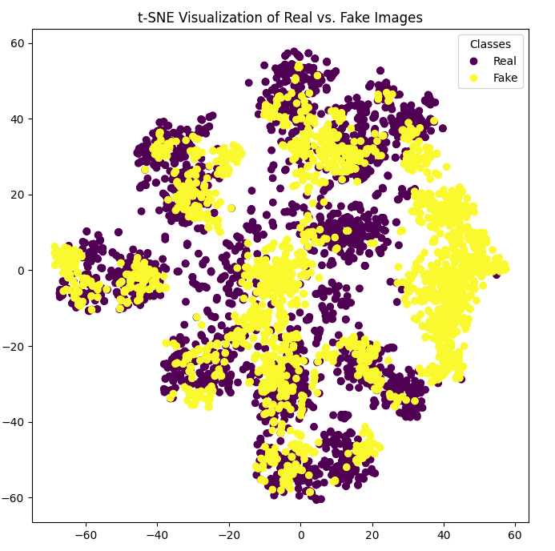

# DeepFake-Image-Detection
Tried to replicate the results of research papers in `Resources` to classify real and deepfake images.

# Paper 4
To create a deepfake detection classifier, I trained using image data from both synthetic images generated by Progan and authentic images used to train Progan. I applied data augmentation techniques to enhance the generaliation ability of the model. Then, I utilized the CLIP model from OpenAI to extract feature embeddings, essentially transforming each image into a unique representation. These embeddings were visualized using t-SNE plots, enabling me to observe their distribution patterns. Finally, I implemented image classification using nearest neighbor and linear classification methods as outlined in research paper 4.

## Table of Contents

- [Preprocessing](#preprocessing)
- [Feature Extraction](#feature-extraction)
- [t-SNE Plot](#t-sne-plot)
- [Nearest Neighbor Approach](#nearest-neighbor-approach)
- [Linear Classification Approach](#linear-classification-approach)
- [Accuracy](#accuracy)

## Preprocessing
- 1. **JPEG Compression** : It converts the given format of image to .jpg with 80% 
- 2. **Gaussian Blur** :  It applies a gaussian blur filter with radius=2(std deviation) to half of the images using np.random.rand()<0.5

## Feature Extraction
Features from the images are extracted using the CLIP (Contrastive Language-Image Pre-training) model. The features are then saved for further analysis and classification tasks.

## t-SNE Plot


## Nearest Neighbor Approach
In our approach to classify deepfakes, we utilize the pre-trained CLIP:ViT visual encoder. This encoder transforms the entire training dataset into their respective feature representations, each comprising 768 dimensions. The resulting feature bank, denoted as ϕ bank, is a combination of feature representations for real (ϕ R) and fake (ϕ F) images, where ϕ R = {ϕ r1, ϕ r2, ..., ϕ rN} and ϕ F = {ϕ f1, ϕ f2, ..., ϕ fN}.

During the testing phase, an image x is first mapped to its feature representation ϕ x. Using cosine distance as the metric (denoted as d), we find the nearest neighbor for x in both the real (ϕ R) and fake (ϕ F) feature banks. The prediction, indicating whether the image is real (0) or fake (1), is determined based on the smaller distance between x and its nearest neighbors:
```scss
pred(x) = {
    1, if min_i(d(ϕ_x, ϕ_fi)) < min_i(d(ϕ_x, ϕ_ri))
    0, otherwise
}
```
In this classification scheme, the CLIP:ViT encoder remains frozen during the process, ensuring that the learned representations are not altered. This approach enables effective discrimination between real and fake images by leveraging the semantic information embedded within the feature representations.

## Linear Classification Approach

In the Linear Classification approach, a neural network is trained using TensorFlow's Keras API, specifically employing an FCNN (Fully Connected Neural Network) architecture.

### Data Preparation
The feature vectors from real and fake datasets are concatenated into `X_train`, and corresponding labels `y_train` are defined. Both are subsequently converted into NumPy arrays.

### Hyperparameters
- **Batch Size:** 30
- **Epochs:** 7 (Further epochs led to overfitting)

### Model Structure
The model consists of two fully connected layers:
- The first layer has 768 units and employs the ReLU activation function.
- The output layer has 1 unit with a sigmoid activation function.

### Compilation of Model
The model is compiled using the Adam optimizer and binary crossentropy loss function.
- **Optimizer:** Adam
- **Loss Function:** Binary Crossentropy

These configurations were chosen to facilitate effective training and classification within the neural network model.

## Accuracy
- Trained on Progan image dataset
1. **Nearest Neighbor Method(k=1)**
 
| Dataset              |    Accuracy   |     SOTA      |
| -------------------- | ------------- | ------------- |
| CycleGan             |    62.9%      |     98.14%     |
| Biggan               |    57.99%      |     94.49%    |
| Dalle and Laion      |    56.49%      |     77.52%       |

2. **Linear Classification**

| Dataset              |    Accuracy   |     SOTA      |
| -------------------- | ------------- | ------------- |
| CycleGan             |    98.1%      |     98.5%     |
| Biggan               |    93.9%      |     94.5%    |
| Dalle and Laion      |    84.5%      |     86.78%       |


The .pt files(extracted features of images from clip model) can be accessed from the `extracted_features_paper_4` Folder 
The model created for Linear Classification is present with named `lc_paper_4.h5` in the saved_models folder
# Paper 2
Implemented the hierarchical multi-level approach mentioned in paper 2 where each level results are as follows:

## Level-1(Real vs Fake):
To classifiy real class from fake class Achieves 54% accuracy to detect real and Fake Images (Trained on Dalle generated fake images and Laiom Real images and tested on Biggan generated fake images).

## Level-2(GANs vs DMs):
The model trained for detecting the source or the model which generated the fake image achieves a Testing Accuracy of 63%(Trained on dalle and biggan).

## Level-3(Each model under GAN classification and each model under DMs): 
Model trained to determine class of image generated from each gan models(9) and diffusion models(4) , (achieved max accuracy of 48% training and testing on the 4 different diffusion models).

## Basic Architecture
In each level a pretrained ResNet50 classifier was used with FCNN layers added in the end for respective classification task, along with fine tuning or unfreezing some layers of ResNet50 to train it to our specific task.
All the above models are still under work, and constant attempt is being made to replicate accuracy of the reasearch papers.

# Datasets Used:

Diffusion Models: [Link](https://drive.google.com/file/d/1FXlGIRh_Ud3cScMgSVDbEWmPDmjcrm1t/view)

GAN's: [Link](https://drive.google.com/file/d/1z_fD3UKgWQyOTZIBbYSaQ-hz4AzUrLC1/view)


